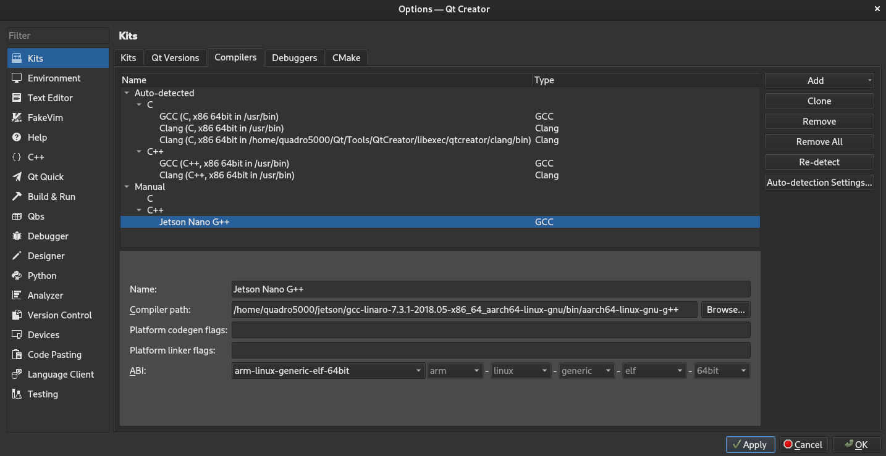
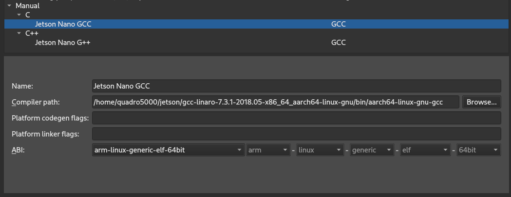
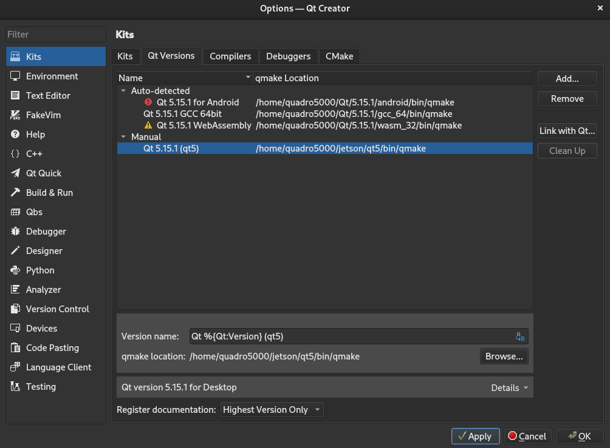
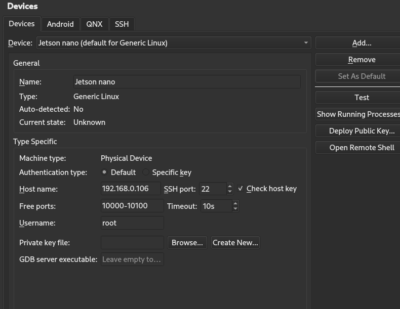
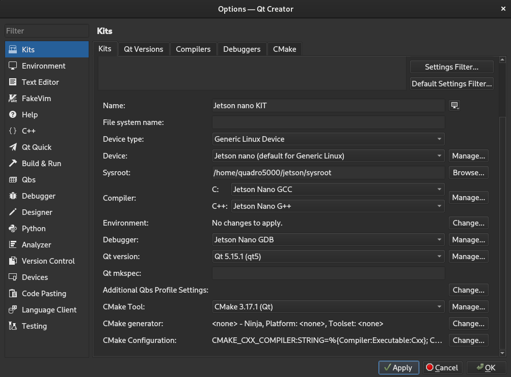

# Jetson QT crosscompile instructions
based on 
https://mechatronicsblog.com/cross-compile-and-deploy-qt-5-12-for-raspberry-pi/


## Jetson
### Install development libraries
We need to install some development libraries, so the first thing to do is to allow the system to install source packages, for this you only have to **uncomment all deb-src** lines in the `/etc/apt/sources.list` file, which configures the system repositories. Use your favorite text editor for this, we are using nano in this example.

```
sudo apt-get update

sudo apt-get install '.*libxcb.*' libxrender-dev libxi-dev libfontconfig1-dev libudev-dev -y

sudo apt-get build-dep qtdeclarative5-dev
```

### Prepare target folder
```
sudo mkdir /usr/local/qt5jetson
sudo chown jetson:jetson /usr/local/qt5jetson
```

### Resolve issues
Edit file `/usr/lib/aarch64-linux-gnu/pkgconfig/libdrm.pc`

replace it with this:
```

prefix=/usr
libdir=${prefix}/lib/aarch64-linux-gnu
includedir=${prefix}/include

Name: libdrm
Description: Userspace interface to kernel DRM services
Version: 2.4.95
Libs: -L${libdir} -L${libdir}/tegra -ldrm -ldrm -lnvll -lnvrm -lnvdc -lnvos -lnvrm_graphics -lnvimp
Cflags: -I${includedir} -I${includedir}/drm -I${includedir}/libdrm
```

## Host computer

### copy host ssh public key to jetson
```
JETSON_IP="192.168.0.106"
ssh-copy-id -i ~/.ssh/id_rsa.pub jetson@$JETSON_IP
```

### Create and configure sysroot folder
```
mkdir ~/jetson
cd ~/jetson
mkdir sysroot sysroot/usr sysroot/opt

wget https://raw.githubusercontent.com/riscv/riscv-poky/master/scripts/sysroot-relativelinks.py

chmod +x sysroot-relativelinks.py

rsync -avz jetson@$JETSON_IP:/lib sysroot
rsync -avz jetson@$JETSON_IP:/usr/include sysroot/usr
rsync -avz jetson@$JETSON_IP:/usr/lib sysroot/usr

./sysroot-relativelinks.py sysroot
```

### Download GCC toolchain
```
wget http://releases.linaro.org/components/toolchain/binaries/7.3-2018.05/aarch64-linux-gnu/gcc-linaro-7.3.1-2018.05-x86_64_aarch64-linux-gnu.tar.xz

tar -xvf gcc-linaro-7.3.1-2018.05-x86_64_aarch64-linux-gnu.tar.xz
```

### Download qt base

```
cd ~/jetson
git clone git://code.qt.io/qt/qtbase.git
cd qtbase
QT_VER="5.15.1"
git checkout $QT_VER
```

```
cd ~/jetson/qtbase/mkspecs/devices
cp -R linux-jetson-tx1-g++ linux-jetson-nano-g++
cd linux-jetson-nano-g++
rm qmake.conf
nano qmake.conf
```

paste this:
```
include(../common/linux_device_pre.conf)

# deb-multi-arch madness
QMAKE_INCDIR_POST += \
    $$[QT_SYSROOT]/usr/include/$${GCC_MACHINE_DUMP}

QMAKE_LIBDIR_POST += \
    $$[QT_SYSROOT]/usr/lib \
    $$[QT_SYSROOT]/lib/$${GCC_MACHINE_DUMP} \
    $$[QT_SYSROOT]/usr/lib/$${GCC_MACHINE_DUMP}

QMAKE_RPATHLINKDIR_POST += \
    $$[QT_SYSROOT]/usr/lib \
    $$[QT_SYSROOT]/usr/lib/$${GCC_MACHINE_DUMP} \
    $$[QT_SYSROOT]/lib/$${GCC_MACHINE_DUMP}
# end: deb-multi-arch madness

# Qt is gonna hurt you if you dont supply this for aarch64 targets
DISTRO_OPTS += aarch64
# end: Qt is gonna hurt you if you dont supply this for aarch64 targets

# sane baseline CXXFLAG
COMPILER_FLAGS               += -march=armv8-a+crypto+crc
# end: sane baseline CXXFLAG

# use eglfs + egldevice not X11 by default
EGLFS_DEVICE_INTEGRATION = eglfs_kms_egldevice
# end: use eglfs + egldevice not X11 by default

include(../common/linux_arm_device_post.conf)
load(qt_config)
```

make copy in case if we fail to build and clean:
```
cd ..
cp -R linux-jetson-nano-g++/ ~/jetson/
```

### Configure QT for cross compilation
on fedora:
```
sudo dnf install make automake gcc gcc-c++ kernel-devel
```
on ubuntu:
```
sudo apt-get install build-essential
```

configure:

```
cd ~/jetson/qtbase

./configure -pkg-config -device linux-jetson-nano-g++ -opengl es2 -qpa eglfs -egl -qt-sqlite -device-option CROSS_COMPILE=~/jetson/gcc-linaro-7.3.1-2018.05-x86_64_aarch64-linux-gnu/bin/aarch64-linux-gnu- -sysroot ~/jetson/sysroot -opensource -confirm-license -make libs -prefix /usr/local/qt5jetson -extprefix ~/jetson/qt5jetson -hostprefix ~/jetson/qt5 -v
```

verify QPA backends, it should look like this:
```
QPA backends:
  DirectFB ............................... no
  EGLFS .................................. yes
  EGLFS details:
    EGLFS OpenWFD ........................ no
    EGLFS i.Mx6 .......................... no
    EGLFS i.Mx6 Wayland .................. no
    EGLFS RCAR ........................... no
    EGLFS EGLDevice ...................... yes
    EGLFS GBM ............................ no
    EGLFS VSP2 ........................... no
    EGLFS Mali ........................... no
    EGLFS Raspberry Pi ................... no
    EGLFS X11 ............................ yes
  LinuxFB ................................ yes
  VNC .................................... yes

```

make:
```
make -j 48
make install
```

if you fail:
```
git clean -dfx
cp -R ~/jetson/linux-jetson-nano-g++/ ~/jetson/qtbase/mkspecs/devices/
```


### Install modules
```
cd ~/jetson
git clone git://code.qt.io/qt/qtdeclarative.git -b $QT_VER
cd qtdeclarative
~/jetson/qt5/bin/qmake
make -j 4
make install
```

```
cd ~/jetson
git clone git://code.qt.io/qt/qt3d.git -b $QT_VER
cd qt3d
~/jetson/qt5/bin/qmake
make -j 4
make install
```

```
cd ~/jetson
git clone git://code.qt.io/qt/qtquickcontrols.git -b $QT_VER
cd qtquickcontrols
~/jetson/qt5/bin/qmake
make -j 4
make install
```

```
cd ~/jetson
git clone git://code.qt.io/qt/qtquickcontrols2.git -b $QT_VER
cd qtquickcontrols2
~/jetson/qt5/bin/qmake
make -j 4
make install
```

```
cd ~/jetson
git clone git://code.qt.io/qt/qtserialport.git -b $QT_VER
cd qtserialport
~/jetson/qt5/bin/qmake
make -j 4
make install
```

```
cd ~/jetson
git clone git://code.qt.io/qt/qtsvg.git -b $QT_VER
cd qtsvg
~/jetson/qt5/bin/qmake
make -j 4
make install
```

```
cd ~/jetson
git clone git://code.qt.io/qt/qtlocation.git -b $QT_VER
cd qtlocation
~/jetson/qt5/bin/qmake
make -j 4
make install
```

```
cd ~/jetson
git clone git://code.qt.io/qt/qtmultimedia.git -b $QT_VER
cd qtmultimedia
~/jetson/qt5/bin/qmake
make -j 4
make install
```

```
cd ~/jetson
git clone git://code.qt.io/qt/qtgraphicaleffects.git -b $QT_VER
cd qtgraphicaleffects
~/jetson/qt5/bin/qmake
make -j 4
make install
```

### Sync everything back to jetson
```
cd ~/jetson

rsync -avz qt5jetson jetson@$JETSON_IP:/usr/local
```

## Jetson

### Wipe already installed system QT
```
cd /usr/lib/aarch64-linux-gnu
sudo rm *qt*
sudo rm -R *qt*
sudo rm *Qt*

LD_LIBRARY_PATH=/usr/local/qt5jetson/lib
export LD_LIBRARY_PATH
```

### Disable or Enable X11

Disable:
```
sudo systemctl set-default multi-user.target
```

Enable:
```
sudo systemctl set-default graphical.target
```


## Computer Try example 
```
cd qtbase/examples/opengl/qopenglwidget
~/jetson/qt5/bin/qmake
make

scp qopenglwidget jetson@$JETSON_IP:/home/jetson
```

## Permit ssh root login
```
sudo passwd root
sudo nano /etc/ssh/sshd_config
```

in `/etc/ssh/sshd_config` add line:
```
PermitRootLogin yes
```

restart ssh service
```
sudo systemctl restart sshd.service
```


## QT Creator deploy

1. Go to Tools->Options->Build&Run->Kits->Compilers
2. Add->GCC->C++
3. Click browse button and select: ~/jetson/gcc-linaro-7.3.1-2018.05-x86_64_aarch64-linux-gnu/bin/aarch64-linux-gnu-g++
4. Rename compiler 



and GCC



GDB


QMAKE







## *.pro file config
In your *.pro file add lines(location where to deploy your app) for example:

```
target.path = /home/jetson/<some folder>
INSTALLS += target
```